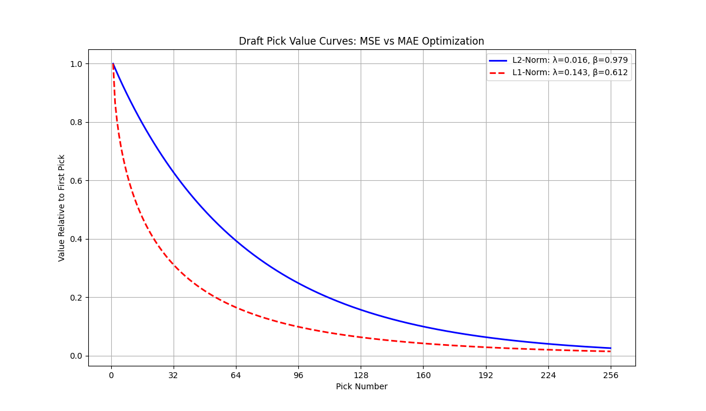
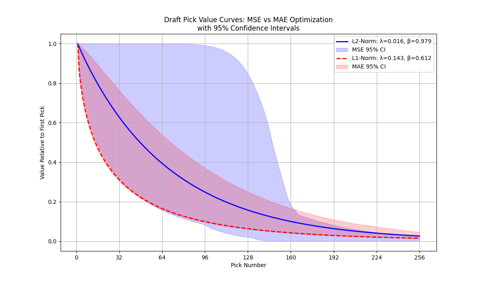

# DraftDynamics

DraftDynamics is a Python-based tool designed to analyze sports draft pick trades using Weibull curves. It aims to provide insights into the value dynamics of draft picks for both teams involved in a trade.

## Features

- **Weibull Curve Fitting**: Estimate `λ` (lambda) and `β` (beta) parameters for draft pick value curves using both MSE and MAE optimization.
- **Data Preprocessing**: Cleans and organizes draft trade data for analysis.
- **Trade Value Calculation**: Computes the net trade value for each transaction using customizable parameters.
- **Visualization**: Generate and compare Weibull value curves for different optimization methods.
- **Flexible and Extendable**: Easily customize or expand for other sports or analysis scenarios.

## Results

A comparison of the Weibull curve with both L1 and L2 Norm:

This plot shows the confidence intervals for the Weibull curve parameters:

